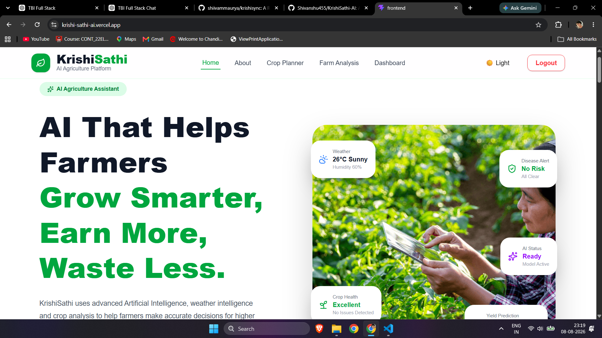
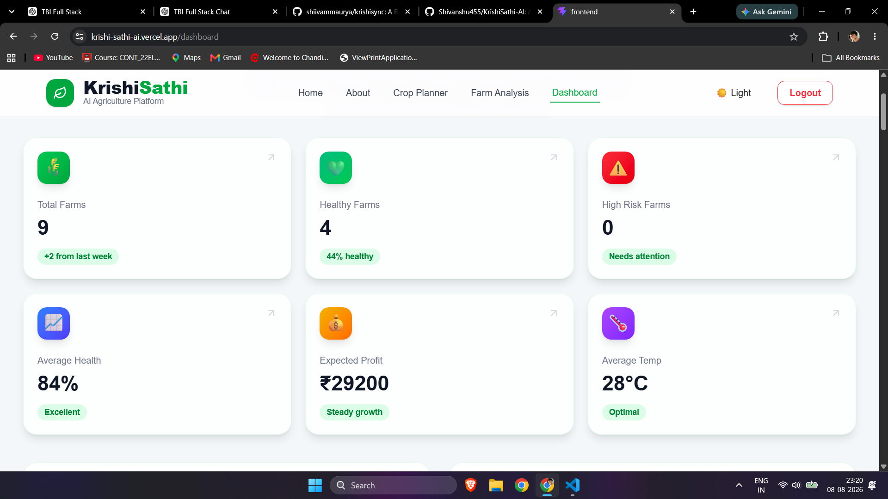
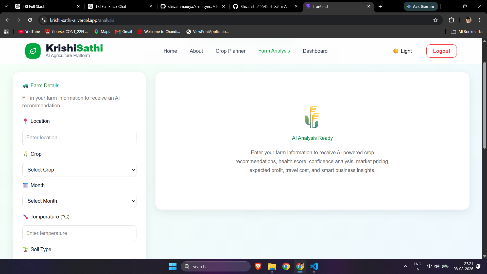
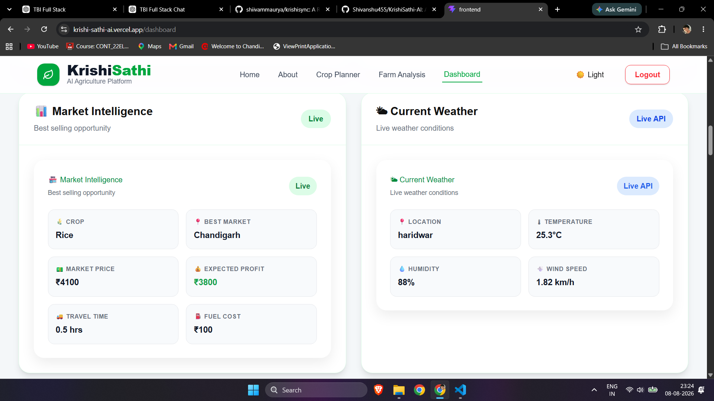

# 🌾 KrishiSathi — AI-Powered Smart Agriculture Platform

KrishiSathi is an AI-powered smart agriculture platform designed to help farmers make data-driven decisions across crop selection, cultivation planning, weather intelligence, market insights, profit estimation, and farm management.

The platform combines modern full-stack technologies with Google Gemini AI to transform agricultural data into actionable, farmer-friendly recommendations.

---

## 🚀 Live Application

### Frontend
https://krishi-sathi-ai.vercel.app

### Backend API
https://krishisathi-ai-backend.onrender.com

### GitHub Repository
https://github.com/Shivanshu455/KrishiSathi-AI

---

## 📸 Screenshots

> Add your actual screenshots to the `screenshots/` folder before committing.

### Home


### Farmer Dashboard


### Farm Analyzer


### Weather Intelligence


---

# ✨ Features

## 🌱 AI Crop Recommendation

Provides crop recommendations based on agricultural inputs such as:

- Soil type
- Location
- Season
- Environmental conditions

The recommendation system uses Google Gemini AI to generate contextual agricultural guidance.

---

## 🧠 AI-Powered Agricultural Assistance

KrishiSathi uses the Google Gemini API to transform agricultural information into understandable and actionable recommendations.

The AI layer supports:

- Crop recommendations
- Cultivation planning
- Agricultural decision support
- Farmer-friendly explanations
- Context-aware recommendations

---

## 🌾 Cultivation Planning

Generates structured cultivation guidance to help farmers understand the major stages involved in growing a selected crop.

The platform can provide step-by-step guidance from sowing through harvesting based on the available agricultural context.

---

## 🌦️ Weather Intelligence

Provides weather-related information to help farmers make better decisions around:

- Sowing
- Irrigation
- Crop management
- Harvesting
- Weather-sensitive activities

---

## 📈 Market Insights

Provides market-oriented information including:

- Market recommendation
- Price trends
- Potentially suitable markets
- Crop-specific market insights

---

## 💰 Profit Simulation

Helps farmers estimate potential profitability using agricultural and market-related inputs.

This provides an additional decision-support layer before committing resources to a crop.

---

## 🧑‍🌾 Farm Management

Farmers can manage their farm information and use stored farm data for generating agricultural recommendations.

---

## 📊 Interactive Dashboard

The dashboard provides a centralized view of the farmer's agricultural information and generated insights.

---

## 🔐 Authentication

The application supports secure user authentication using:

- JWT authentication
- Google OAuth

---

## 🌙 Dark Mode

The frontend supports light and dark interface modes for improved usability in different lighting conditions.

---

## 📱 Responsive UI

The application is designed to provide a consistent experience across:

- Desktop
- Tablet
- Mobile

---

## 🛡️ API Rate Limiting

The backend implements API rate limiting to help protect services from excessive requests and improve application stability.

---

# 🧠 Artificial Intelligence

## Model Used

**Google Gemini API**

KrishiSathi uses the Gemini API as its primary AI reasoning layer.

### AI Workflow

```text
Farmer Input
     │
     ▼
Soil / Location / Season / Crop Data
     │
     ▼
FastAPI Backend
     │
     ▼
Prompt Engineering
     │
     ▼
Google Gemini API
     │
     ▼
AI-Generated Recommendation
     │
     ▼
Backend Processing & Validation
     │
     ▼
Farmer Dashboard